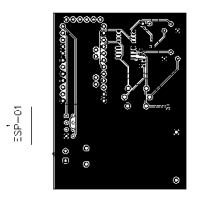
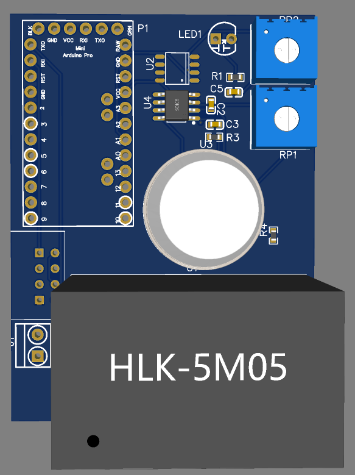

# SmartFireSafetySystem
A smart fire safety sensor that sends active and passive notifications via MQTT by monitoring smoke, gas and flame sensors.

## Contents
- [Schematic](#schematic)
- [PCB](#pcb)
- [3D View](#3d-view)

## Schematic

## PCB

## 3D View

